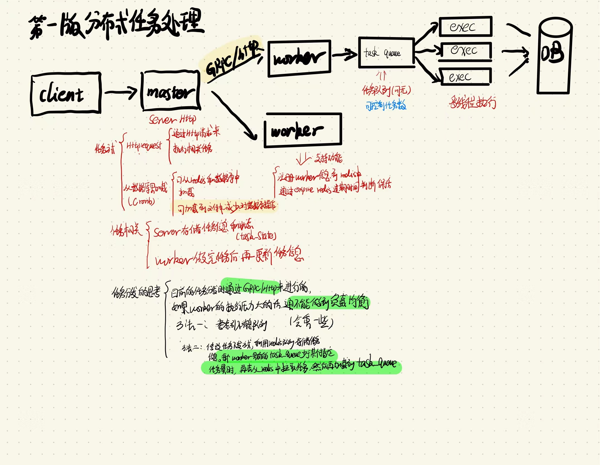

# worker_tools

### 一、简介

### 二、项目相关

2.1、启动方式：

go run main.go master

go run main.go worker

2.2、测试方法

curl -X POST \
  -H "Content-Type: application/json" \
  -d '{"cmd": "cat ./hello.txt"}' \
  http://localhost:3001/tasks
